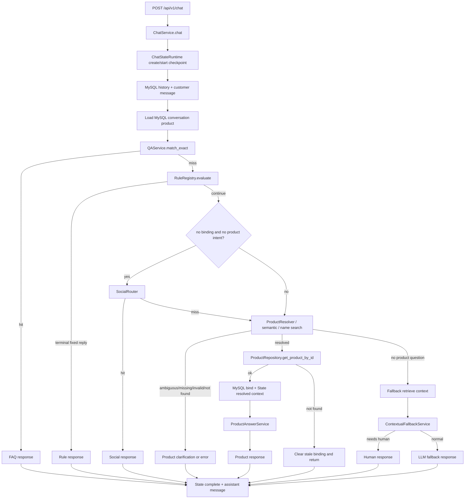
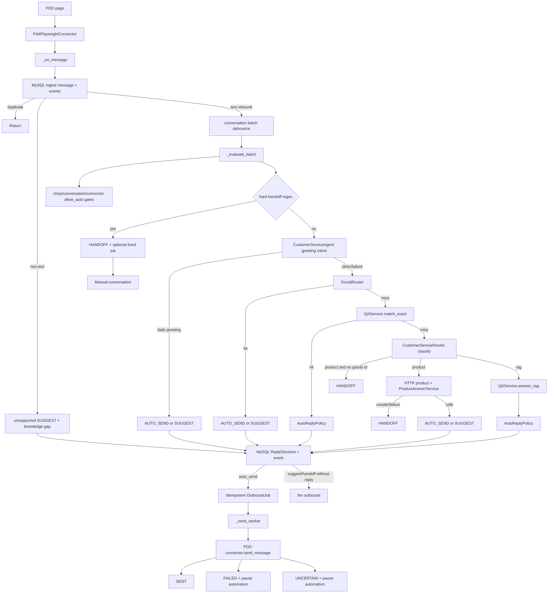
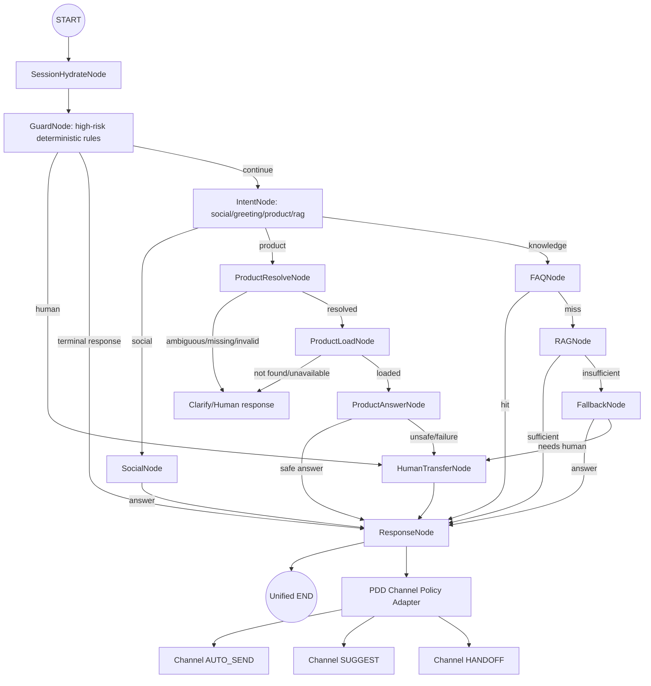

# Agent Graph G0 Baseline

## 1. Executive Summary

**G0 Result: PASS.**

G0 只建立迁移基线，没有实现 Agent Graph，没有修改业务执行顺序，没有新增客服
功能，也没有重构 `ChatService` 或 `ConsoleRuntime`。

当前事实保持不变：

* Unified Chat 的业务决策入口仍是 `ChatService.chat()` →
  `ChatService._route_chat()`。
* PDD 的 AI/业务决策入口仍是 `ConsoleRuntime._on_message()` → debounce →
  `ConsoleRuntime._evaluate_batch()`。
* `app/agent/graph.py`、全部 `app/agent/nodes/*` 和全部 `app/agent/edges/*`
  仍是 TODO 占位。
* Agent Graph 尚未接管任何生产业务路径。

## 2. Repository Baseline

| Item | Result |
|---|---|
| Branch | `master` |
| Start commit | `378cfeb docs(agent): establish graph migration development rules` |
| Working tree at start | clean |
| Freeze | `GRAPH_MIGRATION_FREEZE = active` |
| GitNexus index | 4,724 nodes, 10,209 edges, 167 clusters, 345 flows |
| Full tests | `uv run pytest -q`: **439 passed**, 1 deprecation warning |
| Business code changed | NO |
| End report | `docs/AGENT_GRAPH_G0_BASELINE.md` |

GitNexus 影响分析结果：

| Symbol | Direction | Impacted | Risk | Main evidence |
|---|---:|---:|---|---|
| `ChatService._route_chat` | upstream | 2 | LOW | `ChatService.chat` 调用；`chat` process 8 traced paths；测试 `BrokenChatService` override。 |
| `ChatService._route_chat` | downstream | 20 | MEDIUM | 直接依赖 response helpers、ProductResolver helpers、ProductRepository 和 binding writes。 |
| `ConsoleRuntime._evaluate_batch` | upstream | 9 | MEDIUM | 生产 caller 是 `_evaluate_after_delay` → `_on_message`；另有 7 个 PDD 集成测试直接覆盖。 |
| `ConsoleRuntime._evaluate_batch` | downstream | 30 | **CRITICAL** | 直接耦合 greeting/templates、AutoReplyPolicy、repository writes、handoff、event emit 和 39 traced process paths。 |
| `ConsoleRuntime._on_message` | downstream | 41 | **CRITICAL** | 消息入库、事件、debounce、decision、send worker 与 Console API 共享结构。 |

CRITICAL 是 GitNexus downstream blast radius 的结构性风险，不是本次文档修改造成的
运行时故障。G0 没有修改任何业务符号，因此不存在未解释 HIGH/CRITICAL 业务变更。

## 3. Current Unified Chat Flow

### 3.1 Sequence

```text
POST /api/v1/chat
  → app/api/v1/chat.py::chat
  → Depends(get_chat_service)
      - ConversationProductRepository(session_factory)
      - ChatConversationMessageRepository(session_factory)
      - ProductRepository(HttpProductClient)
      - ContextualFallbackService
      - get_qa_service
      - ChatStateRuntime(FileCheckpointStore)
  → ChatService.chat
      - absent conversation_id 生成 chat-<uuid>
      - ChatStateRuntime.create_state
      - start checkpoint
      - MySQL list_recent_turns(limit=10)
      - MySQL append customer message
  → ChatService._route_chat
  → ChatStateRuntime.complete
  → MySQL append assistant message
  → structured log
  → ApiResponse[ChatResponse]
```

`_route_chat` 的完整当前顺序：

1. `ConversationProductRepository.get_binding()` 读取 MySQL 当前绑定。
2. 有 `product_id` 时，`ChatStateRuntime.hydrate_product_binding()` 写入 Session
   当前商品引用和 recent product id。
3. `QAService.match_exact()` 执行 FAQ exact；命中后 `record_qa()` 并返回
   `source=qa`、`route=faq`。
4. `RuleRegistry.evaluate()` 执行 enrichment 与 terminal rules；
   `record_rule()` 更新 intent/route/human/risk。
5. terminal rule 且有 `fixed_reply` 时直接返回 `source=rule`。当前所有默认
   terminal rules 都带固定回复。
6. 若没有 binding、没有 `product_id` 且 `RuleRegistry` 不要求商品，调用
   `SocialRouter.classify()`；命中社交/情绪时返回 `source=rule`。
7. 构造最多 5 个 recent product references。
8. `ProductResolver.resolve()` 按 request ID、message ID/URL、conversation、history
   识别商品。
9. 当来源是 conversation 且命中 historical-reference pattern 时，调用
   `SemanticProductResolver.resolve()`：
   - ambiguous → `product_selection` / `history_semantic`；
   - matched → 替换为 `history_semantic` product id；
   - 未命中 → 继续原 resolution。
10. 若非 explicit 且不保留当前绑定，调用 `ProductResolver.extract_name_query()`。
11. 有名称查询时调用 `ProductRepository.search_products_by_name()`：
    - 0 候选 → `product_not_found`；
    - 唯一 exact 或唯一 contains → load/bind/answer；
    - 多候选 → `product_selection`，不绑定。
12. 非 explicit 且有 URL 但无法解析时返回 `product_link_invalid` 或
    `product_link_unsupported`。
13. `product_question` 且没有 product id → `product_missing`。
14. 有 product id 时 `ProductRepository.get_product_by_id()`：
    - not found 且来源是 conversation → clear MySQL binding 和 Session 引用，返回
      `product_not_found`；
    - lookup failure → `ProductServiceUnavailableError`；
    - 成功 → bind MySQL 并在 product question 时写入 resolved product context。
15. product question 调用 `ProductAnswerService.answer()`；异常包装为
    `LLMInvocationError`，成功返回 `source=product`、`route=product`。
16. 非 product question 进入 `_generate_fallback()`：
    - `QAService.retrieve_context_candidates()` 失败时降级为空 references；
    - `ContextualFallbackService.generate()` 失败时抛 `LLMInvocationError`；
    - `needs_human=true` 返回 `source=llm_fallback`、`route=human`；
    - 否则返回 `source=llm_fallback`、`route=llm_fallback`。

### 3.2 Early Return / Exit Inventory

| Exit | Trigger | Response route/source | Side effect |
|---|---|---|---|
| API validation | FastAPI Pydantic | 422 envelope | none |
| Chat exception | repository/LLM/product exception | original AppException 或 502 映射 | failed checkpoint |
| FAQ exact | `QAService.match_exact` hit | `faq` / `qa` | none |
| Human request | `HumanHandoffRule` | `human` / `rule` | none |
| Complaint | `ComplaintRule` | `human` / `rule` | none |
| After-sale action | `AfterSaleRiskRule` | `human` / `rule` | none |
| Greeting | `GreetingRule` | `greeting` / `rule` | none |
| Courtesy | `CourtesyRule` | `small_talk` / `rule` | none |
| Social | `SocialRouter` | `small_talk` or `empathy` / `rule` | none |
| Semantic ambiguity | semantic resolver ambiguous | `product_selection` / `product` | none |
| Name no match | 0 search result | `product_not_found` / `product` | none |
| Name ambiguous | multiple candidates | `product_selection` / `product_selection` | none |
| Unsupported URL | URL exists but unsupported/invalid | `product_link_unsupported` / `product_link_invalid` | none |
| Product missing | product question without ID | `product_missing` / `product` | none |
| Product not found | repository 404 | `product_not_found` / `product` | clears stale conversation binding only |
| Product answer | resolved product | `product` / `product` | binds MySQL product |
| LLM needs human | fallback result | `human` / `llm_fallback` | none |
| LLM fallback | fallback result | `llm_fallback` / `llm_fallback` | none |

### 3.3 Current Unified Chat Diagram



## 4. Current PDD Runtime Flow

### 4.1 Lifecycle

```text
FastAPI lifespan(console_enabled=true)
  → ShopRuntimeManager(ConsoleRepository, qa_provider, Settings)
  → manager.initialize(): restore desired-online shops
  → per shop ConsoleRuntime
  → PddPlaywrightConnector.start(on_message, on_status, on_profile)
```

`ShopRuntimeManager` 为每店维护独立 `ConsoleRuntime`、browser profile 和 connector；
status ERROR 会调度最多 3 次指数退避重启。它属于 Channel lifecycle，不属于客服
决策。

### 4.2 Message to decision

1. `PddPlaywrightConnector` 轮询/观察页面，产出 `BrowserMessage`。
2. `_on_message()` 调用 `ensure_initialized()`。
3. `ConsoleRepository.ingest_message()` 原子入库并按 platform message id /
   fingerprint 去重。
4. 重复消息直接返回。
5. 新消息发布 `conversation.upserted` 和 `message.created`。
6. 停机、outbound、backfill、非 text 或空 content 不进入 debounce。
7. 非文本消息记录 `route=unsupported`、`action=suggest`、knowledge gap
   `UNSUPPORTED_MESSAGE`。
8. text inbound 消息按 conversation 聚合 batch，取消旧 debounce，并等待
   `auto_reply_debounce_seconds`。
9. `_evaluate_batch()` 读取 conversation/shop/status，并计算：

```text
allow_auto =
  global_auto_reply_enabled
  AND (guarded_auto OR legacy-single-shop)
  AND conversation.auto_reply_enabled
  AND connector READY
```

10. `CustomerServiceRouter.requires_handoff()` 用同步 regex 检查退款、退货、换货、
    取消订单、补发、赔付、赔偿、投诉、差评、平台介入；命中立即 `_handoff()`。
11. 加载 greeting config 后调用 `CustomerServiceAgent.run()`：
    - greeting 规则优先，不出用户资料给模型；
    - 规则未命中时 LLM intent 分类，置信度 >= 0.9 才返回 daily greeting；
    - 回复始终来自店铺 configured templates；
    - Agent 失败保留后续 social/FAQ/product/RAG 路径。
12. daily greeting decision 使用 `auto_send` 或 `suggest`。
13. Agent 无 decision 时调用 `SocialRouter.classify()`；命中生成 social/empathy
    decision。
14. 仍未 decision 时调用 `QAService.match_exact()`：
    - exact FAQ hit → `AutoReplyPolicy.evaluate()`，只允许 reviewed、retrieval-enabled、
      eligible、low-risk 标准回答 auto send；
    - FAQ miss → `CustomerServiceRouter.classify()`。
15. classification 是 product 时：
    - conversation 没有 `goods_id` → `_handoff(send_reply=false)` +
      `PRODUCT_CONTEXT_MISSING`；
    - product provider 失败/404 → `_handoff(send_reply=false)` +
      `PRODUCT_DATA_MISSING`；
    - answer exception → `_handoff(send_reply=false)`；
    - answer 成功时 `ProductAnswerService.can_auto_send()` 要求 facts supported、
      no sensitive/after-sales、no clarification、confidence threshold。
16. classification 是 rag 时调用 `QAService.answer_rag()`，再由 `AutoReplyPolicy`
    校验 review、retrieval、risk、score、margin、calibration 和 eligibility。
17. QA/product/RAG 异常产生 `route=error`、`action=suggest`。
18. decision 写 `reply_decisions`；必要时记录 knowledge gap；发布
    `reply.decision`。
19. `auto_send` decision 创建幂等 `OutboundJob` 并放入 in-memory send queue。

### 4.3 Send and failure paths

```text
send queue
  → _send_worker()
  → _send_job()
  → status queued -> sending
  → PddPlaywrightConnector.send_message()
     - success  -> sent + receipt
     - ConnectorError -> failed + pause conversation automation
     - SendUncertainError -> uncertain + pause conversation automation
```

`OutboundJob` 使用 `(shop_id, client_request_id)` 唯一键。auto id 是
`auto:<batch_key[:59]>`；handoff id 是 `handoff:<batch_key[:56]>`。重启用
`recover_queued_jobs()` 恢复 queued，并把所有 `sending` 改为 uncertain。停机会取消
queued，但不会自动重试 uncertain。

### 4.4 Decision / status inventory

| Decision/action | Current trigger | Outbound result |
|---|---|---|
| `handoff` | hard handoff regex；product context/data/answer unsafe | set manual；optional fixed reply job |
| `auto_send` | greeting/social allow_auto；safe FAQ；safe product；safe RAG | idempotent queued job |
| `suggest` | any allow_auto blocker；unsafe/risk/ambiguous/error；non-text | decision only，no job |
| `unsupported` | non-text/empty message | decision only，no job |
| `error` | QA/product/RAG exception | suggest decision，no job |
| job `queued` | created but not clicked | recovered or cancelled on shutdown |
| job `sending` | clicked/confirmed phase starting | startup recovery marks uncertain |
| job `sent` | connector confirmed | conversation `auto_replied`/`manual` |
| job `failed` | deterministic ConnectorError | pause auto reply |
| job `uncertain` | send clicked but confirmation unknown | never auto retry；pause auto reply |
| job `cancelled` | queued while shop offline | no send |

### 4.5 Current PDD Diagram



## 5. Capability Inventory

| Capability | Current implementation | Current caller | State read | State write | External dependency | Side effect | Target Graph role |
|---|---|---|---|---|---|---|---|
| RuleRegistry | deterministic enrichment/terminal rules | Unified `ChatService._route_chat`; rules API | binding/current product via RuleContext | via ChatStateRuntime | none | none | GuardNode capability |
| SocialRouter | deterministic small talk/empathy | Unified Chat; PDD | binding presence indirectly | none | none | none | SocialNode capability |
| CustomerServiceAgent / greeting | rule-first + LLM greeting intent | PDD | conversation/shop context object | none | LLM intent | LLM cost | IntentNode capability |
| CustomerServiceRouter | ProductContextRule + hints + LLM fallback | PDD FAQ miss | conversation goods id | none | structured LLM | LLM cost | KnowledgeIntent capability / conditional-edge input |
| ProductResolver | deterministic ID/URL/name/history extraction | Unified Chat | binding/recent references | none | none | none | ProductResolveNode capability |
| SemanticProductResolver | LLM maps aliases over <=5 recent products | Unified Chat | recent references | none | LLM | LLM cost | ProductResolveNode capability |
| ProductRepository / HttpProductClient | validates and calls product API | Unified Chat; PDD uses provider directly | none | none | Product HTTP API backed by PostgreSQL | read only | ProductLoadNode capability |
| ProductAnswerService | structured LLM answer over product facts | Unified Chat; PDD | product profile | none | LLM | LLM cost | ProductAnswerNode capability |
| QAService.match_exact | normalized unique FAQ lookup | Unified Chat; PDD | product code/name args | none | in-memory catalog loaded from MySQL | read only | FAQNode capability |
| QAService.retrieve_context_candidates | retriever candidates without generation | Unified fallback | none | none | dense/BM25/Milvus | read only | RAGNode capability |
| QAService.answer_rag | retrieve/rerank/evidence/generate | PDD; QA API | product context args | none | retriever/reranker/LLM | LLM cost | RAGNode capability |
| ContextualFallbackService | history/product/reference LLM fallback | Unified Chat | history/product/references args | state route | LLM | LLM cost | FallbackNode capability |
| AutoReplyPolicy | knowledge risk + score/margin + auto-send gate | PDD | QA metadata/conversation | none | calibration file | none | split: SafetyPolicy inside graph; ChannelSendPolicy outside |
| ChatConversationMessageRepository | recent turns and customer/assistant writes | Unified Chat | messages | messages | MySQL | DB write | SessionHydrate/Response persistence adapter |
| ConversationProductRepository | current binding + recent products | Unified Chat | binding | binding | MySQL | DB write | SessionHydrate/ProductLoad persistence adapter |
| ConsoleRepository | shop/conversation/message/decision/job/gap/config store | PDD runtime | conversation/shop/config | many business facts | MySQL | DB writes | Channel persistence adapter |
| ChatStateRuntime | State Contract recorder/checkpoint lifecycle | Unified Chat | AgentState | AgentState + checkpoint | local file checkpoint | file write/delete | Graph runtime infrastructure |
| StateCoordinator | generic node checkpoint/action/resume | ChatStateRuntime; tests | AgentState | AgentState + checkpoint | checkpoint store | file write | future AgentRuntime checkpoint engine |
| FileCheckpointStore | atomic JSON revision store | ChatStateRuntime | AgentState file | checkpoint file | local disk | file write/delete | Checkpoint adapter |
| EventBroker | in-process SSE publish | PDD runtime | events | events | in-process | event publication | Channel observability |
| ShopRuntimeManager | multi-shop lifecycle/restart/isolation | Console API/lifespan | shop state | shop lifecycle | Playwright/browser | browser lifecycle | Channel runtime, outside graph |
| PddPlaywrightConnector | DOM scanning and confirmed sending | ConsoleRuntime | page/DOM | platform conversation | PDD browser | message send / browser operation | Channel transport, outside graph |

## 6. Orchestration Inventory

| Symbol | Current orchestration responsibility | Should remain orchestrator? | Migration destination |
|---|---|---|---|
| `POST /api/v1/chat` handler | DI, logging context, envelope | No; remains thin API | unchanged API facade |
| `ChatService.chat` | state lifecycle, history/messages, route call, response logging | No; becomes request/response facade | AgentRuntime invoke + persistence adapter |
| `ChatService._route_chat` | FAQ/rule/social/product/fallback/human ordering and early exits | No | AgentGraph nodes + conditional edges |
| `ChatService._resolve_product_name` | name search/selection/load/answer | No | ProductResolve/ProductLoad/ProductAnswer nodes |
| `ChatService._generate_fallback` | RAG context retrieval + fallback + human decision | No | RAGNode/FallbackNode/HumanTransfer edge |
| `ConsoleRuntime._on_message` | initialize, ingest, dedupe, event, debounce | Partly yes | Channel Adapter / batch queue outside AgentGraph |
| `ConsoleRuntime._evaluate_batch` | handoff/greeting/social/FAQ/product/RAG ordering and policy | No | AgentGraph + Channel Policy adapter |
| `ConsoleRuntime._handoff` | decision audit, manual state, optional fixed send | Split | HumanTransferNode decision + Channel outbound adapter |
| `ConsoleRuntime._send_worker` / `_send_job` | serial queue, status transitions, send | Yes | Channel send worker outside AgentGraph |
| `CustomerServiceAgent` | greeting intent + template selection | Capability, not graph itself | IntentNode calls capability |
| `CustomerServiceRouter` | product vs RAG classification | Capability/branch classifier | IntentNode/KnowledgeRouter capability |
| `ChatStateRuntime` | State recorder and coarse `chat_turn` checkpoint | Runtime infrastructure | Graph node checkpoint integration |
| `StateCoordinator` | generic before/after/failed/resume/action checkpoint | Runtime infrastructure | AgentRuntime checkpoint engine |
| `app/agent/graph.py` / nodes / edges | TODO placeholders | N/A | G1 skeleton |

## 7. State Mutation Map

| State/Data | Source of Truth | Created by | Read by | Written by | Lifetime |
|---|---|---|---|---|---|
| `AgentState` | Checkpoint for current turn | `ChatStateRuntime.create_state` | ChatStateRuntime, ChatService | ChatStateRuntime; StateCoordinator in generic path | turn; completed checkpoint deleted |
| `ChatSessionState` | `AgentState.session`; references only | `create_state` | product/state mapping | hydrate/clear/record product; human state; memory ids | one turn in current implementation; session id derives from conversation |
| `ChatTurnState` | `AgentState.turn` | `create_state` | state mapper/logger intent | rule/product/QA/response/failure updates | turn |
| `StatePatch` | merge contract only | node handler in StateCoordinator path | `StateCoordinator.run_node` | applied to AgentState | node execution |
| MySQL `chat_conversation_products` | conversation-product binding | first bind | Unified hydrate/resolver | `bind_product`; `clear_binding` | conversation |
| MySQL `chat_messages` | unified chat message history | customer append; assistant append | `list_recent_turns` | ChatService around routing | retention governed by table |
| MySQL PDD conversation | platform conversation/state | `ingest_message` | `_evaluate_batch`, send/policy | ingest, handoff, automation, outbound status | conversation |
| `ReplyDecision` | immutable audit per shop+batch | `add_decision` | console UI/API | `_evaluate_batch` / `_handoff` | audit retention |
| `OutboundJob` | send state and idempotency | `create_outbound_job` / `handoff_conversation` | worker/UI | queued→sending→sent/failed/uncertain/cancelled | audit retention |
| Checkpoint file | workflow runtime | `FileCheckpointStore.save` | load/resume | atomic replace/delete | until successful turn |
| Product snapshot | current-turn `ResolvedProductContext` | product profile mapper | ProductAnswerService context boundary | record_product_resolved | current turn |

## 8. Persistence Boundaries

* MySQL `database_url` is the customer-service business store for binding, message,
  shop, conversation, decision, outbound, event, config and knowledge tables.
* Product facts are exposed through `HttpProductClient`; the product API is the
  PostgreSQL-backed product boundary. `tmt_service` does not read product tables
  directly.
* QA catalog is loaded from MySQL `cs_qa`; retrieval documents use Milvus/dense and
  BM25 indexes depending on configuration.
* Local JSON files are only Agent workflow checkpoints and calibration/config assets;
  they are not business-fact stores.
* Browser profile directories are PDD channel state, not agent state.

Boundary drifts are listed in section 17 and are not repaired by code in G0.

## 9. Side Effect Inventory

| Side effect | Current owner | Idempotency | Retry behavior | Crash risk | PendingAction candidate |
|---|---|---|---|---|---|
| Append unified customer message | `ChatService.chat` | none; one append per accepted request | no auto retry | duplicate if outer retry is added later | No |
| Append unified assistant message | `ChatService.chat` | none | no auto retry | only after successful response | No |
| Bind conversation product | `ConversationProductRepository.bind_product` | upsert by conversation | next turn can rebind | stale/incorrect binding if retry races | No |
| Clear stale binding | `ConversationProductRepository.clear_binding` | delete if exists | next turn can hydrate again | loses stale reference intentionally | No |
| Create auto outbound job | `ConsoleRepository.create_outbound_job` | unique `(shop_id, client_request_id)`; same payload returns existing | queue item may be recovered only if queued | low; unique key prevents duplicate job | Future external-action model candidate |
| Create handoff reply job | `ConsoleRepository.handoff_conversation` | unique client request id; manual state idempotent | queued only; uncertain never retried | low | Future external-action model candidate |
| PDD browser send | `PddPlaywrightConnector.send_message` | job-level idempotency only; platform click uncertain | `SendUncertainError` never retried | duplicate/uncertain platform message | **Yes** |
| Mark conversation manual | `handoff_conversation` / `_pause_after_send_failure` | state update | safe repeat | low | No |
| Startup send recovery | `ConsoleRepository.recover_queued_jobs` | queued replay; sending→uncertain | never auto-click uncertain | conservative manual handling | **Yes** for sending/uncertain |
| Write checkpoint file | `FileCheckpointStore.save` | optimistic revision + atomic replace | resume by revision | conflict/corruption raises | No |
| Delete completed checkpoint | `ChatStateRuntime.complete` | delete once; missing-ok | cleanup retriable | only observability/history loss | No |
| LLM calls | QA/product/fallback/intent/router | none | caller-specific degradation | cost/non-determinism, no direct business mutation | No unless future mutating Tool |
| Browser lifecycle/restart | `ShopRuntimeManager` / connector | restart bounded | 3 attempts, backoff | login/page instability | Channel concern, not graph action |
| DB event/audit writes | ConsoleRepository | append/event ids | event replay by cursor | low | No |

## 10. Current → Target Node Mapping

| Current responsibility | Current symbol | Target Node/Subgraph |
|---|---|---|
| API request adaptation | `/api/v1/chat`, `ChatService.chat` | API Facade, not graph |
| Session/hydrate | MySQL binding + `ChatStateRuntime.hydrate_product_binding` | `SessionHydrateNode` |
| High-risk rules | `HumanHandoffRule`, `ComplaintRule`, `AfterSaleRiskRule` | `GuardNode` |
| Other deterministic rules | `GreetingRule`, `CourtesyRule`, `SocialRule`, `ProductContextRule` | `GuardNode` / `IntentNode` capability calls |
| Social | `SocialRouter` | `SocialNode` |
| Greeting intent | `CustomerServiceAgent` | `IntentNode` |
| Product/RAG intent | `CustomerServiceRouter` | `IntentNode` |
| Product identity | `ProductResolver` + `SemanticProductResolver` + name search | `ProductResolveNode` |
| Product fact load | `ProductRepository` / `HttpProductClient` | `ProductLoadNode` |
| Product answer | `ProductAnswerService` | `ProductAnswerNode` |
| FAQ exact | `QAService.match_exact` | `FAQNode` |
| RAG | `QAService.answer_rag` / `retrieve_context_candidates` | `RAGNode` |
| LLM fallback | `ContextualFallbackService` | `FallbackNode` |
| Human decision/wording | terminal rules, fallback needs human, PDD handoff | `HumanTransferNode` |
| Response composition | response helpers and ChatResponse mapping | `ResponseNode` |
| State/checkpoint | `ChatStateRuntime` + `StateCoordinator` | AgentRuntime infrastructure around nodes |
| PDD send gate | `AutoReplyPolicy` + allow_auto | Channel Policy Adapter outside graph |
| Outbound delivery | OutboundJob/send worker/connector | Channel transport outside graph |

Do not create one Node per private helper. Product identity remains one coarse
`ProductResolveNode` in G2 because request/message/history/name/semantic resolution
is one business decision with one output contract. QA internals remain inside
`QAService`; graph exposes only `FAQNode` / `RAGNode`.

## 11. Conditional Edge Mapping

| Edge | State field / decision input | Possible targets | Current equivalent |
|---|---|---|---|
| `after_hydrate` | session ready; binding found/cleared | `guard`, `terminal_error` | binding hydrate before routing |
| `after_guard` | terminal rule, `requires_human`, fixed reply, risk | `human_transfer`, `response`, `intent` | RuleRegistry terminal early return |
| `after_intent` | social/greeting/product/RAG classification | `social`, `product_resolve`, `faq`, `rag`, `fallback` | PDD Agent/Social/Router and Unified implicit flow |
| `after_social` | social hit/miss | `response`, `faq`, `product_resolve` | early social response |
| `after_product_resolve` | resolved id, ambiguous, missing, invalid URL, name candidates | `product_load`, `clarify`, `human`, `response` | all product identity early returns |
| `after_product_load` | product found/not found/unavailable | `product_answer`, `clarify`, `error` | repository branches |
| `after_product_answer` | answer safe/unsafe/failed | `response`, `human`, `error`, `fallback` | product answer and PDD safety gates |
| `after_faq` | exact hit/miss and policy risk | `response`, `channel_policy`, `router`, `rag` | exact FAQ early return |
| `after_rag` | sufficient evidence, fallback, human risk | `response`, `fallback`, `human` | RAG evidence/policy branches |
| `after_fallback` | answer, needs human, LLM failure | `response`, `human`, `error` | contextual fallback |
| `after_response` | AgentResult complete | unified END or PDD channel policy | ChatResponse return / decision creation |
| `after_agent_pdd` | suggested answer, human, risk | `auto_send`, `suggest`, `handoff` | AutoReplyPolicy + allow_auto |
| `after_send` | sent/failed/uncertain/cancelled | channel END, alert/manual pause | outbound worker |

Edges must only read the completed node's typed decision and set `next_node`. They
must not query MySQL/PostgreSQL/Milvus, call an LLM, or execute Service/Tool logic.

## 12. Target Graph v1

Target v1 only includes capabilities that already exist. Memory and Tool Runtime are
future extension points, not G1 implementation scope.



### Agent decision versus channel responsibility

**AgentGraph owns:** intent, safety, route, product context, answer draft, evidence,
confidence, `requires_human`, risk reason, response wording.

**Channel Runtime owns:** shop enabled, reception mode, conversation auto-reply,
connector readiness, debounce/batching, send/suggest choice, outbound queue,
platform delivery, send confirmation, uncertain handling, retries/cancellation,
multi-shop browser lifecycle.

Current `AutoReplyPolicy` mixes knowledge safety and channel send action. Migration
should split it without changing behavior:

* Knowledge safety/review/risk/evidence quality → AgentGraph policy capability.
* `allow_auto`, suggest vs auto send, queueing and delivery → PDD Channel Policy
  Adapter.

## 13. Regression Baseline

Current baseline is the full suite: **439 passed**. Important existing coverage:

| Behavior | Existing tests | Coverage quality | Graph migration regression required |
|---|---|---|---|
| Greeting | `tests/rules/test_greeting.py`; `tests/unit/test_chat_service.py::test_greeting_rule_is_terminal_even_with_bound_product`; PDD greeting/agent tests | Strong at unit/integration | Exact route/source/answer contract before and after graph |
| Courtesy | `tests/rules/test_courtesy.py` | Rule-level only | Add unified golden case during G2 |
| Human request | `tests/rules/test_human_handoff.py`; `tests/agent/test_chat_runtime.py::test_terminal_human_rule_completes_without_product_or_qa` | Strong | Keep human state and fixed response |
| Complaint | `tests/rules/test_complaint.py` | Rule-level only | Add unified golden case during G2 |
| After-sale action | `tests/rules/test_after_sale_risk.py`; registry; ChatService terminal case | Strong rule and Unified path | Preserve precedence over product |
| Refund policy question | `test_does_not_match_after_sale_policy_question` | Rule-level | Preserve policy-question continuation |
| Social | `tests/unit/test_social_router.py`; PDD multiroute | Strong PDD; no Unified Chat integration case | Add Unified golden case during G2 |
| Product ID | product resolver + ChatService ID/binding/follow-up tests | Strong | Keep binding and resolution source |
| Product URL | resolver + known/external URL ChatService cases | Strong | Keep supported-host behavior |
| Conversation binding | conversation repository + ChatService + ChatRuntime | Strong | Preserve MySQL authoritative reference |
| Product name | exact, contains, no-match, ambiguous ChatService cases | Strong | Preserve candidate contract |
| Candidate selection | `test_multiple_name_contains_matches_require_selection` | Focused | Preserve no-binding on ambiguity |
| Historical product | resolver + ChatService recovery test | Strong | Preserve recent-product order |
| Semantic reference | semantic resolver + ChatService alias test | Strong | Preserve ambiguity/failure fallback |
| FAQ exact | `tests/qa/test_qa_service.py`; ChatService precedence; PDD exact FAQ | Strong | Preserve current FAQ-before-rule behavior until tested reorder |
| RAG | QA service retrieval/evidence/fallback/generation tests | Strong at service level | Add route-level golden comparison in G2 |
| Fallback | ContextualFallbackService + ChatService context tests | Strong | Preserve history/product/reference input |
| State checkpoint | State contract/checkpoint + ChatRuntime tests | Strong | Map coarse turn checkpoint to node lifecycle |
| Checkpoint recovery | interrupted turn, stale revision, uncertain action tests | Strong | Preserve revision/PendingAction semantics |
| PDD handoff | multiroute handoff/product-missing cases | Strong | Preserve manual state and optional fixed reply |
| PDD auto send | greeting/product/FAQ/policy tests | Strong | Preserve standard-answer-only auto send |
| Human takeover | handoff + uncertain send pause tests | Good | Preserve no-auto-send after human/failure |
| Send failure | uncertain connector integration + repository recovery | Strong for uncertain; no dedicated deterministic `ConnectorError` runtime case | Add Channel golden case before G5 |
| Multi-shop isolation | multishop idempotency/restore/account tests | Strong | Preserve shop-scoped decisions/jobs |

No new characterization test was added in G0 because the existing suite already
provides a broad executable baseline and passes. G2/G5 must import these cases into
a shared golden strategy before switching any path.

## 14. Coverage Gaps

1. Unified Chat has no end-to-end case asserting `SocialRouter` precedence over
   FAQ/RAG; only SocialRouter unit and PDD integration cover it.
2. Unified Chat has no API-level courtesy golden case; only the rule is tested.
3. Complaint is rule-tested but lacks an integrated Unified Chat output assertion.
4. Refund policy question continuation into product/QA is rule-tested but lacks a
   ChatService golden assertion.
5. PDD deterministic `ConnectorError` to `FAILED` is not directly covered at runtime
   integration level; uncertain failure is covered.
6. QA natural-language answer equality is intentionally not a stable cross-runtime
   contract; route/evidence/source/confidence must be used instead.
7. `StatePatch` is covered by StateCoordinator tests but not used by the current
   Unified Chat recorder path.

## 15. Compatibility Test Strategy

### Golden cases

Create parameterized cases with stable inputs and expected **contracts**, not exact
LLM prose unless the answer is deterministic from rules/FAQ/templates.

Required fields:

```text
input message/conversation/product context
expected route
expected answer category or exact deterministic answer
expected source
expected product_resolution / product id
expected requires_human
expected confidence policy
expected side-effect decision for PDD
expected state category
```

### Equality policy

| Field | Compatibility rule |
|---|---|
| `route` | exact equality |
| `source` | exact equality |
| `product_resolution` | exact equality |
| resolved product id | exact equality |
| `requires_human` | exact equality |
| rule/greeting/FAQ fixed answer | exact equality |
| product generated answer | semantic/fact-based assertion plus required fact tokens |
| RAG generated answer | semantic/fact assertion; do not require exact LLM prose |
| retrieval counts | exact or bounded equality, fixed at migration cutover |
| confidence | exact for deterministic capabilities; range for LLM-backed capability |
| side-effect decision | exact `AUTO_SEND` / `SUGGEST` / `HANDOFF` / no-send |
| debug/logging fields | presence and trace-id propagation; content redaction |

### Dual-run strategy

1. Keep Legacy runtime as authoritative until a phase is accepted.
2. Run the same fixture through Legacy and Graph in test-only mode.
3. Compare the contract above.
4. For LLM-backed answers, inject deterministic Fake LLMs or compare fact extraction.
5. Record diffs as release blockers unless explicitly accepted as equivalent.
6. Do not remove Legacy tests until G6 removes duplicate orchestration.

## 16. Migration Risk Register

| Risk | Severity | Current protection | Required migration protection |
|---|---|---|---|
| ChatService behavior drift | High | broad ChatService/API/state tests | golden dual-run; preserve route/source/product fields |
| ConsoleRuntime behavior drift | Critical | PDD multiroute/greeting/runtime tests | channel adapter contract and PDD golden cases |
| Rule ordering change | Critical | rule unit/registry tests; ChatService/PDD cases | lock current order before Guard reorder; add explicit reorder tests |
| FAQ ordering change | High | exact FAQ tests document FAQ-before-rule | two-step migration: baseline then safety reorder with approval |
| Product context loss | Critical | binding, resolver, semantic and state tests | MySQL binding remains source; ProductResolve output contract |
| Conversation binding loss | Critical | repository/service/state tests | atomic bind/clear and stale-binding tests |
| Semantic product regression | High | resolver failure/ambiguity tests | deterministic candidates plus Fake LLM golden cases |
| Checkpoint mismatch | High | revision/conflict/recovery tests | StatePatch and node lifecycle tests before G3 completion |
| Duplicate side effects | Critical | unique outbound key; uncertain never retried | PendingAction idempotency and channel adapter ownership |
| AutoReplyPolicy bypass | Critical | policy unit/integration tests | split policy but preserve all gates before send |
| PDD send duplication | Critical | batch key/job idempotency; recovery marks uncertain | keep delivery outside graph; dual-run side-effect assertions |
| State schema compatibility | High | v1→v2 checkpoint tests | schema validation and migration fixture |
| Debug metadata regression | Medium | chat logging/state tests | stable debug fields and redaction tests |
| Logging trace loss | Medium | logging E2E/request-id tests | request/conversation context propagation |
| Console coupling blast radius | Critical | 439 passing tests but CRITICAL downstream impact | G5 must isolate channel adapter and avoid big-bang rewrite |

## 17. Documentation Drift

The following drift was found and corrected only in documentation:

1. `docs/STATE_DESIGN.md` previously summarized Unified Chat as
   `RuleRegistry → Product → QAService`. Code actually performs MySQL hydrate →
   FAQ exact → RuleRegistry → optional Social → Product → fallback RAG context.
2. Product facts are not read directly by `ProductRepository`; it calls an HTTP
   product API. That API is the PostgreSQL-backed product boundary.
3. The migration plan previously said “若干 Node/Edge 文件” without stating that
   every node/edge file is a TODO placeholder. They are not implemented capabilities.

Known architecture issue recorded, not repaired:

* `ConsoleRuntime._evaluate_batch` owns AI orchestration and channel policy in one
  method. This is the intentional G5 migration point.
* `ChatStateRuntime` mutates State directly and checkpoints a coarse `chat_turn`;
  `StatePatch` is implemented but not yet the production Node update mechanism.

## 18. G1 Scope

G1 may start only as an isolated skeleton. It must not take production traffic.

### G1 may create

```text
app/agent/runtime.py
app/agent/graph.py
app/agent/nodes/__init__.py
app/agent/nodes/base.py
app/agent/nodes/session_hydrate.py
app/agent/nodes/guard.py
app/agent/nodes/response.py
app/agent/edges/__init__.py
app/agent/edges/base.py
app/agent/edges/guard_edge.py
tests/agent/test_graph_skeleton.py
tests/agent/test_agent_runtime_skeleton.py
```

File names may be adjusted in the G1 task, but the scope must remain runtime,
protocols, minimal nodes, minimal edges, StatePatch integration, and tests.

### G1 may modify

```text
app/agent/state.py only if a non-breaking protocol helper is required
docs/AGENT_GRAPH_MIGRATION.md status/evidence
```

### G1 must not modify

```text
app/services/chat_service.py
app/services/console_runtime.py
app/agent/chat_runtime.py production behavior
app/agent/checkpoint.py semantics
app/rules/*
app/services/product_resolver.py
app/services/semantic_product_resolver.py
app/services/product_service.py
app/qa/*
app/repositories/*
app/models/*
alembic/*
app/integrations/pdd/*
```

### G1 acceptance

1. `AgentRuntime` can compile and invoke an executable graph skeleton.
2. Node protocol accepts `AgentState` and returns `StatePatch | None`.
3. Edge protocol returns a typed next-node decision only.
4. Skeleton path executes hydrate → guard → response → END with fake capabilities.
5. Before/after/failed checkpoints can be produced without replacing Unified Chat.
6. No production API or PDD path calls the skeleton.
7. New tests plus full `uv run pytest -q` pass.
8. `uv run ruff check .` passes.
9. GitNexus change analysis has no unexplained HIGH/CRITICAL risk.

**G1 Entry: READY.**

## 19. G0 Acceptance Result

| Requirement | Result |
|---|---|
| Unified Chat current chain fully identified | PASS |
| PDD Runtime current chain fully identified | PASS |
| Capability inventory complete | PASS |
| Orchestrator inventory complete | PASS |
| State mutation map complete | PASS |
| Persistence boundary complete | PASS |
| Side effect inventory complete | PASS |
| Current → Node mapping complete | PASS |
| Conditional edge mapping complete | PASS |
| Target Graph v1 complete | PASS |
| Regression baseline complete | PASS |
| Coverage gaps complete | PASS |
| Migration risks complete | PASS |
| G1 scope explicit | PASS |
| `docs/AGENT_GRAPH_G0_BASELINE.md` complete | PASS |
| `docs/AGENT_GRAPH_MIGRATION.md` synchronized | PASS |
| No business semantic change | PASS |

**G0: PASS. Do not begin G1 in this task.**
