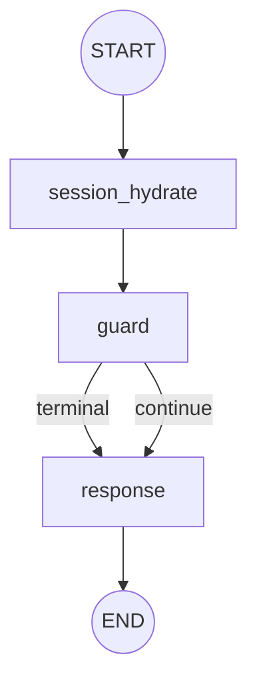

# Agent Graph G1 Runtime

## 1. G1 Result

```text
G1 = PASS
GRAPH_MIGRATION_FREEZE = active
G2 = NOT_STARTED
```

Agent Graph executable: **YES**

Production takeover: **NO**

ChatService orchestrator: **STILL ACTIVE**

ConsoleRuntime orchestrator: **STILL ACTIVE**

Node checkpoint persistence: **NOT YET — G3**

G1 只建立显式可执行 Runtime。没有修改 `/api/v1/chat`、`get_chat_service`、
`ChatService._route_chat()`、PDD `ConsoleRuntime._evaluate_batch()` 或任何生产
发送逻辑。

## 2. LangGraph Dependency

```text
pyproject.toml: langgraph>=1.2,<2
uv.lock: langgraph 1.2.11
```

使用 LangGraph low-level API：

```python
from langgraph.graph import StateGraph, START, END
```

没有使用 `create_agent` 或高层预构建 Agent，没有手写替代 Graph Engine。
`StateGraph.compile()` 没有配置 LangGraph checkpointer。

依赖一致性验证：

```bash
uv sync --frozen
```

## 3. Runtime Architecture

```text
Explicit caller / tests
    ↓
AgentRuntime.invoke(AgentState)
    ↓
CompiledStateGraph.ainvoke(AgentState)
    ↓
GraphNodeAdapter
      - AgentState.model_validate
      - model_copy(deep=True)
      - begin_node
      - business node returns StatePatch
      - AgentState.apply_patch
      - complete_node / fail_node
      - model_dump transport snapshot
    ↓
LangGraph StateGraph
    ↓
AgentState.model_validate(result)
```

新增 Runtime files:

```text
app/agent/runtime.py
app/agent/graph.py
app/agent/protocols.py
app/agent/nodes/session.py
app/agent/nodes/guard.py
app/agent/nodes/response.py
app/agent/edges/guard_edge.py
```

## 4. Node Contract

所有业务 Node 遵循：

```python
async def __call__(self, state: AgentState) -> StatePatch:
    ...
```

`AgentNode` Protocol 是 runtime-checkable。Node 只能读取传入的隔离 State 快照，
返回 `StatePatch`；禁止返回整个 `AgentState`、任意 dict，或原地修改共享状态。

G1 Nodes:

| Node | Responsibility | Capability |
|---|---|---|
| `SessionHydrateNode` | validate in-memory Session/Turn contract | no DB / no repository |
| `GuardNode` | call existing `RuleRegistry.evaluate()` | deterministic rules capability |
| `ResponseNode` | converge fixed reply / skeleton answer | no QA, product, fallback, or LLM |

`SessionHydrateNode` does not load MySQL binding or message history. Real hydration
migration belongs to G2.

## 5. StatePatch Adapter

`GraphNodeAdapter` 是 LangGraph transport adapter，不定义第二套业务字段。

Merge flow:

```text
AgentNode
  ↓
StatePatch
  ↓
AgentState.apply_patch()
  ↓
working.model_dump()
  ↓
LangGraph state update
```

This deliberately reuses the existing `AgentState.apply_patch()` semantics. It does
not add a Graph-specific merge, change `StateCoordinator`, or change
`ChatStateRuntime`.

Node lifecycle uses existing State methods:

```text
AgentState.begin_node()
AgentState.apply_patch()
AgentState.complete_node()
AgentState.fail_node()
```

Lifecycle is in-memory only in G1. Durable before/after/failed checkpoints and resume
integration remain in G3.

## 6. Conditional Edge Contract

`after_guard` is a pure routing function:

```python
def after_guard(state: AgentState) -> str
```

Allowed return keys:

```text
terminal
continue
```

It reads only already-computed state decisions, including `context["guard_terminal"]`,
`final_answer`, and Session human state. It does not call RuleRegistry, Service,
repository, LLM, logger for business state, or send messages.

## 7. Graph Topology



Compiled topology:

```text
START
session_hydrate
guard
response
END
```

Guard terminal cases reuse existing rules:

```text
我要人工 → HumanHandoffRule → route=human
我要退款 → AfterSaleRiskRule → route=human
```

Continue case:

```text
今天天气怎么样 → no terminal rule → response skeleton
```

## 8. Error Semantics

`GraphNodeAdapter` isolates the input, tracks node lifecycle, and catches node
exceptions. A failed node raises `AgentNodeExecutionError` with:

```text
failed_state
node_name
original_exception
```

The failed in-memory State contains:

```text
status = FAILED
error.node = failed node
error.code = exception class name uppercased
resume_from = failed node
node_trace[-1].status = failed
```

`AgentGraphExecutionError` represents compilation, non-node execution, or invalid
Graph output failures. Runtime revalidates output with
`AgentState.model_validate(result)`; invalid output is never returned as success.

No exception is swallowed and reported as successful.

## 9. Current Production Boundary

```text
Production Unified Chat:
/api/v1/chat → ChatService → _route_chat()

Production PDD:
BrowserMessage → ConsoleRuntime → _evaluate_batch()

Explicit G1 only:
AgentState → AgentRuntime → LangGraph StateGraph
```

No production dependency injection, feature flag, API route, ChatService branch, or
ConsoleRuntime branch references `AgentRuntime` or `build_agent_graph`.

## 10. Tests

Dedicated tests:

```text
tests/agent/test_graph_runtime.py
```

Coverage includes:

1. LangGraph compilation and topology.
2. Async `AgentRuntime.invoke()`.
3. Output revalidation to `AgentState` with nested Session/Turn.
4. `AgentState → StatePatch` node contract.
5. Guard continue.
6. Guard terminal for human request and after-sale action.
7. Pure conditional-edge route keys.
8. Existing `StatePatch` merge behavior.
9. No input mutation on success.
10. Node failure contract and no input mutation on failure.
11. Invalid Graph output rejection.
12. Production files have no Runtime references.

Validation:

```bash
uv run pytest tests/agent -q  # 84 passed
uv run pytest -q              # 453 passed
uv run ruff check .           # passed
git diff --check              # passed
uv sync --frozen              # passed
```

## 11. Known Limitations

* Production takeover: none.
* `session_hydrate` does not load MySQL binding or chat history.
* Only hydrate / guard / response nodes exist.
* Continue path produces an explicit skeleton answer, not real customer service.
* Product, QA/RAG, Social, Fallback, Memory, and Tool remain unmigrated.
* Node checkpoints are in-memory only; `FileCheckpointStore` is not attached per node.
* No LangGraph checkpointer is configured.
* Real rule ordering change remains G2 characterization work; Legacy still uses
  FAQ exact before rules.

## 12. G2 Entry Criteria

**G2 Entry: READY.**

Ready evidence:

* AgentRuntime is stable and async.
* Graph topology compiles and is asserted.
* Node protocol is fixed.
* StatePatch adapter reuses `AgentState.apply_patch()`.
* Guard edge and failure semantics are tested.
* Full regression is green.

G2 must not start automatically. Its next task must define Unified Chat
characterization dual-run, production-safe cutover/rollback strategy, and real
Session hydration migration before replacing `ChatService._route_chat()`.
