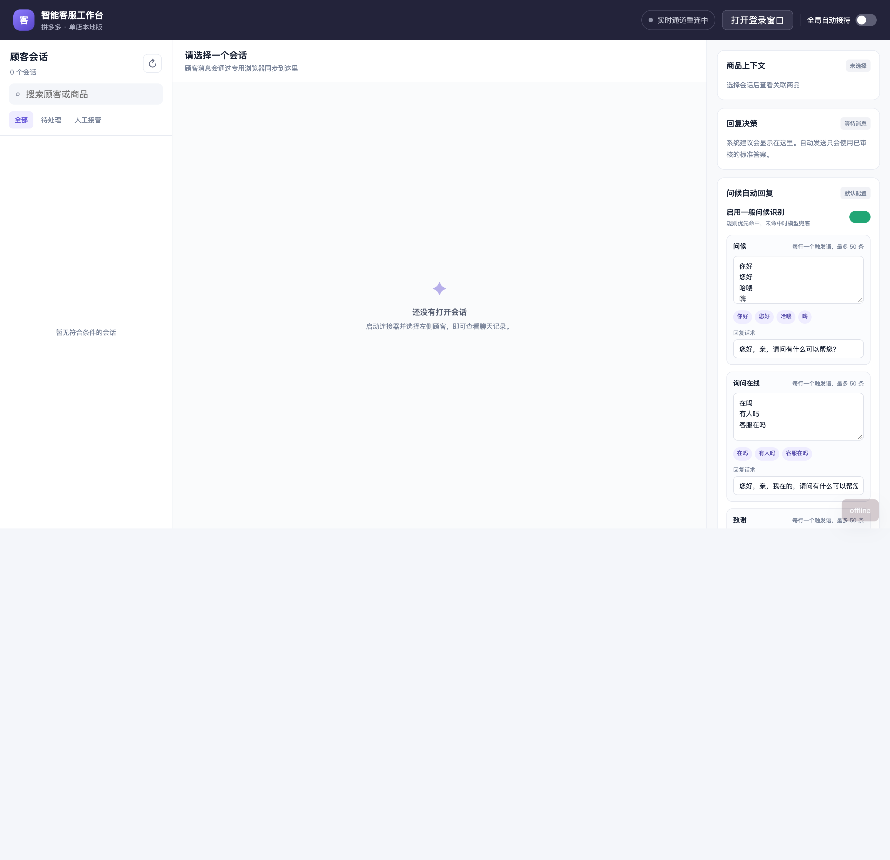

# 一般回复意图识别与可配置自动回复实施报告

## 1. 结论

一般问候链路已经从“模型结构化分类 + 模型生成回复”升级为“店铺规则优先 + 模型兜底分类 + 中台固定话术回复”。配置内短语不调用大模型即可生成回复；模糊寒暄可由模型识别，但回复仍取中台配置，不再进行第二次模型生成。

自动发送继续遵守三重安全条件：连接器 `ready`、全局自动接待开启、当前会话自动接待开启。任一条件不满足时只生成人工建议，并在决策原因中说明阻断原因。



## 2. 根因与修复

### 2.1 原始故障

运行日志中意图识别链路曾出现：

```text
Error code: 400 - Thinking mode does not support this tool_choice
```

原因是当前 `deepseek-flash` 处于 thinking 模式，而旧实现使用 `with_structured_output(..., method="function_calling")`，会触发供应商不支持的强制 `tool_choice`。随后系统进入 QA/RAG 降级链路，又因本地 BGE 模型目录缺失而失败，最终没有可发送答案。

### 2.2 修复方式

- 规则优先：`你好`、`在吗`、`谢谢`、`拜拜`等配置内完整短语零模型调用。
- 模型兜底：规则未命中时改用普通模型调用，提示词要求只返回严格 JSON，不再使用 `function_calling/tool_choice`。
- 安全阈值：模型必须返回 `daily_greeting` 且置信度不低于 `0.90` 才进入问候分支。
- 失败降级：非法 JSON、低置信度、超时或供应商异常均按非问候处理，继续既有 QA/RAG 流程，不会错误自动发送。
- 固定话术：识别成功后直接读取店铺配置话术，避免第二次模型调用带来的延迟、费用和失败点。

## 3. 功能说明

### 3.1 四类问候

| 分类 | 默认触发语 | 默认回复 |
| --- | --- | --- |
| 问候 `salutation` | 你好、您好、哈喽、嗨 | 您好，亲，请问有什么可以帮您？ |
| 询问在线 `availability` | 在吗、有人吗、客服在吗 | 您好，亲，我在的，请问有什么可以帮您？ |
| 致谢 `thanks` | 谢谢、辛苦了、感谢 | 不客气，亲，很高兴能帮到您。 |
| 告别 `goodbye` | 再见、拜拜、先这样 | 好的，亲，感谢您的咨询，祝您生活愉快！ |

规则匹配先做 NFKC、大小写、首尾空白和末尾常用标点归一化，然后进行完整短语匹配。因此 `在吗？！` 可以命中，`你好，我想退款` 不会因为包含“你好”而被误判。

### 3.2 店铺配置

新增 `shop_greeting_configs` 一对一店铺配置表：

- `enabled`：一般问候识别开关。
- `trigger_groups`：四类触发语 JSON。
- `reply_templates`：四类固定回复 JSON。
- `created_at` / `updated_at`：审计时间。

历史店铺首次读取时懒创建默认配置；通过 API 保存后立即生效，无需重启服务。接口会去空值、去重、限制单类最多 50 条、单条触发语最多 40 字、回复最多 400 字，并拒绝同一触发语出现在多个分类。

### 3.3 HTTP 接口

- `GET /api/v1/automation/greeting`：读取当前店铺配置。
- `PUT /api/v1/automation/greeting`：校验并保存当前店铺配置。

请求体包含 `enabled`、`trigger_groups`、`reply_templates`，四个分类均必须提供。

### 3.4 中台界面

右侧决策面板新增“问候自动回复”配置卡：

- 总开关。
- 四类触发语，每行一个，实时标签预览。
- 四类回复话术。
- 恢复默认配置前强制确认。
- 保存成功后提示“下一条消息立即生效”。
- 回复决策中展示问候分类、规则/模型识别来源、分数和建议/自动发送状态。

## 4. 验收结果

### 4.1 自动化验证

```bash
.venv/bin/ruff check app tests
.venv/bin/pytest -q
```

结果：

- Ruff：All checks passed。
- Pytest：123 passed，3 skipped。

新增覆盖点：

- 规范化：全半角、大小写、空白、末尾标点。
- 四类问候分类和对应话术。
- `你好，我想退款` 不被规则误判。
- 规则命中时模型调用次数为 0。
- 模型兜底 JSON 解析、低置信度和异常安全降级。
- 意图链路必须使用普通 LLM，禁止回归到 `tool_choice` 结构化输出。
- 模型超时或异常时安全降级为非问候。
- 配置默认初始化、立即更新、重复触发语和超限校验。
- API 请求清洗、重复分类冲突返回 422。
- 全局自动接待关闭时仅建议。
- 开启全局自动接待后自动创建发送任务并真实调用连接器测试替身。
- 保存后的新话术在下一条消息立即生效。

### 4.2 效果矩阵

| 用户消息 | 验收结果 |
| --- | --- |
| `你好` | 规则识别 `salutation`，模型调用 0 次，回复默认问候话术 |
| `在吗？！` | 规则识别 `availability`，使用在线话术 |
| `谢谢亲` | 可由规则扩展或模型兜底识别 `thanks`，使用致谢话术 |
| `拜拜` | 规则识别 `goodbye`，使用告别话术 |
| `您好，方便帮忙吗` | 规则未命中，模型兜底识别后使用中台话术 |
| `你好，我的快递到哪了` | 不进入问候分支，继续业务 QA/RAG |
| 全局自动接待关闭 | `action=suggest`，说明“全局自动接待未开启” |
| 三项发送条件满足 | `action=auto_send`，创建幂等发送任务并调用连接器 |

### 4.3 页面验收

使用本地 Chrome 无头渲染并拦截离线 API 后验证：

- 配置卡可见。
- 4 个分类字段完整渲染。
- 13 个默认触发语标签完整渲染。
- 4 条默认回复完整填充。
- 页面无 JavaScript 错误。

截图见 [greeting-console-effect.png](greeting-console-effect.png)。

## 5. 数据库与上线

新增迁移：`alembic/versions/20260917_0009_greeting_config.py`。

上线顺序：

1. 执行 `alembic upgrade head`。
2. 保持全局自动接待关闭，发送四类测试消息，确认只生成建议且话术正确。
3. 在测试会话开启自动接待，验证真实拼多多发送和状态审计。
4. 确认连接器稳定、无阻挡弹窗后，再开启全局自动接待。
5. 观察规则命中、模型兜底、失败降级和自动发送日志。

新迁移本身已生成兼容 SQLite 的 DDL，且集成测试通过 SQLAlchemy metadata 在 SQLite 上创建新表。注意：从空库完整执行历史迁移时，既有 `20260916_0005` 迁移包含 SQLite 不支持的 ALTER FK，属于本需求之前的问题；生产 MySQL 不受该历史限制影响。

## 6. 影响分析与风险

按项目要求执行 GitNexus upstream impact：

- `CustomerServiceAgent.run`：LOW，2 个直接影响。
- `CustomerServiceAgent._recognize_intent`：LOW，1 个直接影响、1 条流程。
- `ConsoleRuntime._evaluate_batch`：LOW，2 个直接影响、1 条流程。
- `Shop`：LOW，11 个影响。
- `renderDecision`：HIGH，影响 `openConversation`、`loadConversations`、`loadStatus` 相关 3 条前端流程；本次仅追加可空字段展示并保留原渲染路径。
- `ensure_shop` 和 `_sanitize_event_payload`：CRITICAL；本次未修改这两个符号，分别改为独立懒加载方法和新增安全事件类型，规避扩大影响。

最终 `detect-changes --scope all` 结果：22 个文件、127 个符号、62 条流程，整体 CRITICAL。该结果包含本次开始前工作区已有的响应倒计时、消息资源、PDD workbench 等未提交改动，不能全部归因于问候功能。本轮通过全量测试、静态检查、页面 DOM 验收和新增集成测试覆盖关键风险。

## 7. 未纳入本阶段

- 订单、物流、退款等业务意图扩展。
- 缺失本地 BGE/RAG 模型的修复。
- 拼多多页面结构长期适配与连接器稳定性治理。
- 多店铺配置切换界面；当前数据结构已按店铺隔离，界面仍服务当前单店。
